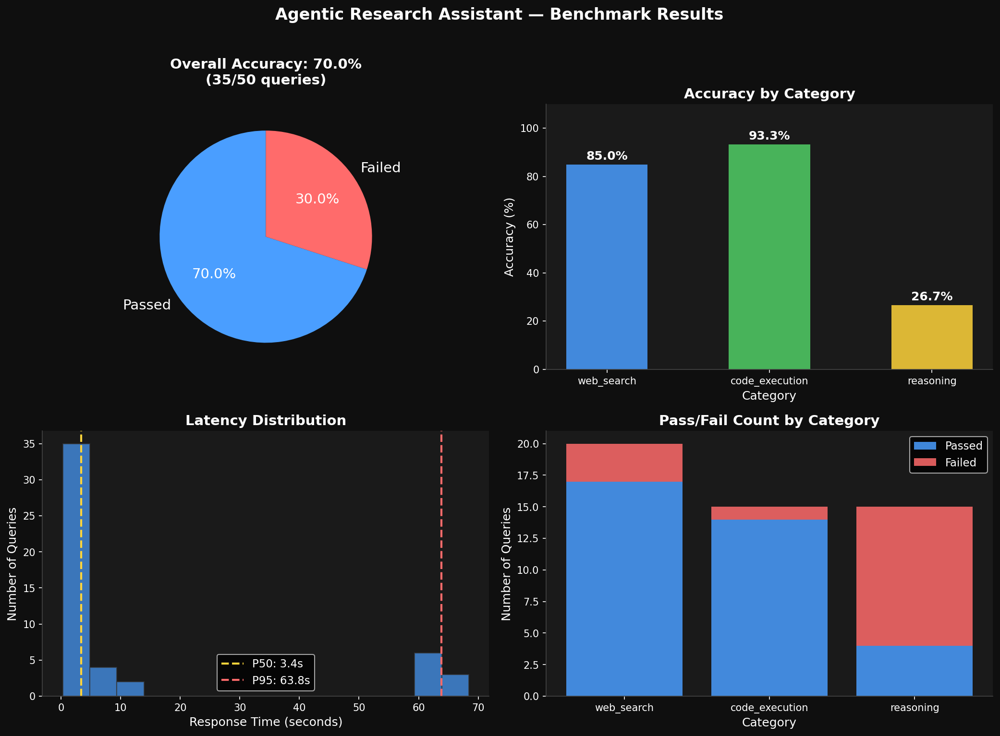

# Agentic Research Assistant

A production-grade **ReAct agent** built with LangGraph that autonomously orchestrates multiple tools to answer complex multi-hop queries. Features streaming output, multi-turn memory, structured tool invocation, and a full benchmark evaluation suite.



---

## Architecture

```
User Query
    ↓
[Flask Chat UI] ← SSE Streaming
    ↓
[LangGraph ReAct Loop]
    ↓
[Reason Node] → Does LLM need a tool?
    ├── YES → [Tool Node] → Execute Tool → Back to Reason
    │           ├── web_search    (Tavily API)
    │           ├── code_executor (sandboxed subprocess)
    │           └── doc_lookup    (FAISS vector search)
    └── NO  → [Final Answer] → Stream to UI
```

---

## Key Results

| Metric | Value |
|---|---|
| Overall Accuracy | 70% (35/50 queries) |
| Web Search Accuracy | 85% |
| Code Execution Accuracy | 93.3% |
| P50 Latency | 3.4s |
| P95 Latency | 63.8s |

> Evaluated using keyword-based scoring across 50 benchmark queries spanning web search, code execution, and multi-hop reasoning tasks.

---

## Tech Stack

| Component | Technology |
|---|---|
| Agent Framework | LangGraph |
| LLM | Cerebras (llama-3.3-70b) |
| Web Search | Tavily API |
| Vector Store | FAISS |
| Embeddings | HuggingFace (all-MiniLM-L6-v2) |
| API Layer | Flask + SSE Streaming |
| Evaluation | Custom benchmark + matplotlib |
| Observability | LangSmith |

---

## Features

- **ReAct Pattern** — agent loops through Reason → Act → Observe until it has a final answer
- **3 Tools** — web search, sandboxed Python execution, local document lookup
- **Streaming UI** — tokens stream token-by-token via Server-Sent Events
- **Multi-turn Memory** — remembers conversation history across turns with automatic trimming
- **Structured Tool Invocation** — Pydantic schemas validate all tool inputs
- **Benchmark Suite** — 50 queries across 3 categories with visual dashboard
- **Safety** — tool call limit (max 10) prevents infinite loops; subprocess timeout prevents runaway code

---

## Project Structure

```
agentic-research-assistant/
├── src/
│   ├── agent/
│   │   ├── graph.py        ← LangGraph ReAct state machine
│   │   ├── state.py        ← AgentState TypedDict
│   │   ├── memory.py       ← Multi-turn conversation memory
│   │   └── runner.py       ← Agent execution + streaming
│   ├── tools/
│   │   ├── web_search.py   ← Tavily web search
│   │   ├── code_executor.py← Sandboxed Python execution
│   │   └── doc_lookup.py   ← FAISS document retrieval
│   └── config.py           ← Centralized configuration
├── evaluation/
│   ├── benchmark.py        ← 50-query benchmark suite
│   ├── queries.py          ← Benchmark query definitions
│   └── visualize.py        ← Matplotlib dashboard generation
├── templates/
│   └── index.html          ← Chat UI with markdown rendering
├── app.py                  ← Flask application
└── requirements.txt
```

---

## Setup

**1. Clone and create virtual environment**
```bash
git clone https://github.com/Sejwanipunit/agentic-research-assistant.git
cd agentic-research-assistant
python -m venv venv
source venv/Scripts/activate  # Windows Git Bash
pip install -r requirements.txt
```

**2. Configure environment variables**
```bash
cp .env.example .env
# Fill in your API keys
```

**3. Run the app**
```bash
python app.py
```

Open `http://127.0.0.1:5000` in your browser.

---

## Environment Variables

```env
CEREBRAS_API_KEY=     # Cerebras API key (free tier at cloud.cerebras.ai)
TAVILY_API_KEY=       # Tavily API key (free tier at app.tavily.com)
LANGCHAIN_API_KEY=    # LangSmith API key (free tier at smith.langchain.com)
LANGCHAIN_TRACING_V2=true
LANGCHAIN_PROJECT=agentic-research-assistant
```

---

## Running the Benchmark

```bash
# Run 50-query benchmark
python evaluation/benchmark.py

# Generate visualization dashboard
python evaluation/visualize.py
```

---

## How the ReAct Loop Works

```
Turn 1:
  User: "Find recent papers on RAG and summarize them"
  LLM:  "I need to search for this" → calls web_search
  Tool: Returns search results
  LLM:  "Now I have enough to answer" → final response

Turn 2 (multi-turn):
  User: "Write code to implement the chunking strategy you mentioned"
  LLM:  Remembers previous context → calls code_executor
  Tool: Executes Python code, returns output
  LLM:  Shows code + output in response
```

---

## Design Decisions

**Why LangGraph over LangChain agents?**
LangGraph models the ReAct loop as an explicit state machine — nodes and edges are visible, debuggable, and extensible. LangChain's AgentExecutor abstracts this away making it harder to customize.

**Why subprocess for code execution instead of `exec()`?**
`exec()` runs in the same process — a crash or infinite loop kills the entire app. `subprocess` isolates execution with a hard timeout, preventing runaway code from affecting the agent.

**Why FAISS for doc lookup instead of Qdrant?**
FAISS runs in-memory with zero infrastructure — no Docker, no server. For a local document store with hundreds of documents, FAISS is the right tradeoff. Qdrant is better for production scale with millions of vectors.

**Why keyword-based evaluation instead of LLM-as-judge?**
Keyword matching is transparent, reproducible, and free. In production I'd layer LLM-as-judge on top for semantic correctness evaluation.

---

## Related Projects

- [Production RAG Pipeline](https://github.com/Sejwanipunit/production-rag-pipeline) — The RAG system that inspired the doc_lookup tool
